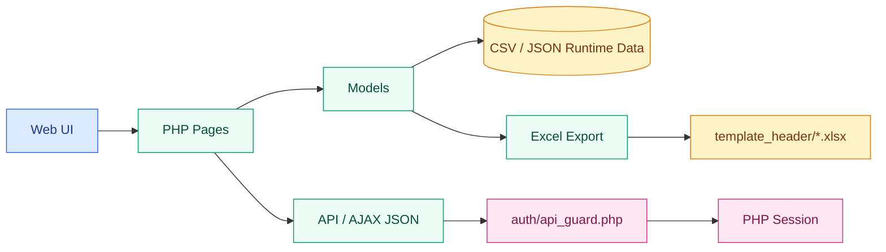
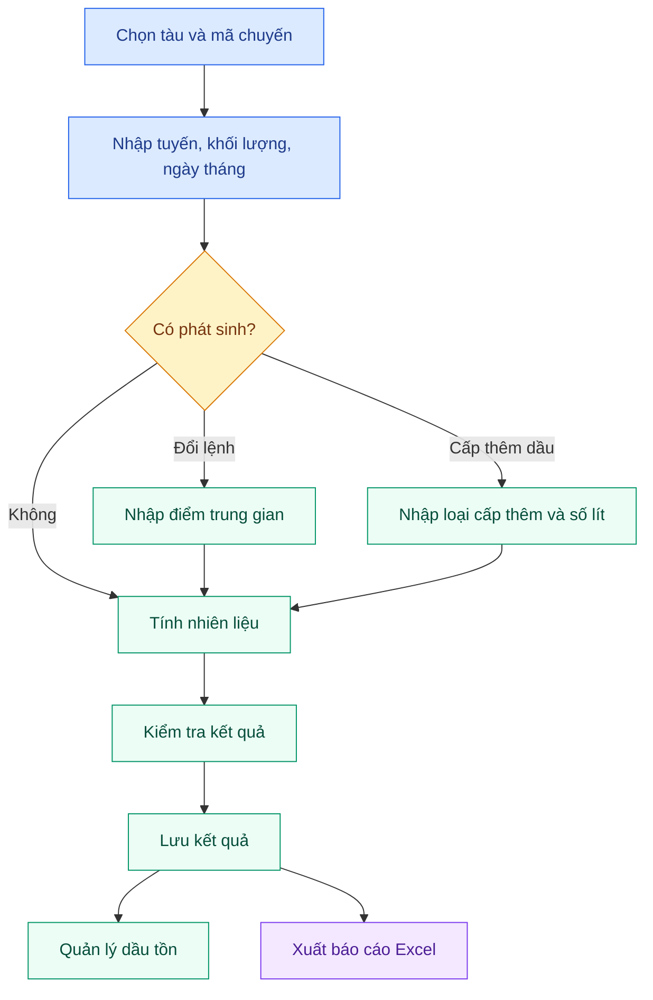

<p align="center">
  
</p>

<h1 align="center">TINHDAU v1.4.1</h1>

<p align="center">
  Hệ thống tính định mức nhiên liệu, quản lý chuyến tàu, theo dõi dầu tồn và xuất báo cáo Excel cho vận hành nội bộ VICEM Logistics.
</p>

<p align="center">
  
  
  
  
  
  
</p>

<p align="center">
  <a href="#tong-quan">Tổng quan</a>
  &nbsp;&middot;&nbsp;
  <a href="#khoi-chuc-nang">Khối chức năng</a>
  &nbsp;&middot;&nbsp;
  <a href="#cai-dat-nhanh">Cài đặt</a>
  &nbsp;&middot;&nbsp;
  <a href="#bao-mat-phan-quyen">Bảo mật</a>
  &nbsp;&middot;&nbsp;
  <a href="#api-du-lieu">API & dữ liệu</a>
  &nbsp;&middot;&nbsp;
  <a href="#lich-su-thay-doi">Changelog</a>
  &nbsp;&middot;&nbsp;
  <a href="#license">License</a>
</p>

---

<a id="tong-quan"></a>

## Tổng quan

TINHDAU là ứng dụng PHP chạy tốt trên XAMPP/Apache, lưu trữ bằng file CSV/JSON thay vì SQL database. Hệ thống tập trung vào các nghiệp vụ nội bộ:

| Tính năng | Giá trị vận hành |
|---|---|
| Tính nhiên liệu | Tính nhanh theo tàu, tuyến đường, cự ly, hàng hóa và hệ số tàu |
| Quản lý chuyến | Lưu chuyến, sắp xếp đoạn, chèn/xóa/di chuyển đoạn giữa các chuyến |
| Xử lý phát sinh | Đổi lệnh, cấp thêm dầu, nhiều lệnh Ma nơ trong một chuyến |
| Dầu tồn | Theo dõi dầu tồn theo tháng, theo tàu, điều chuyển giữa các tàu |
| Báo cáo | Xuất Excel tổng hợp, báo cáo tháng, báo cáo dầu tồn, in tính dầu với header template |

> [!IMPORTANT]
> Đây là phần mềm nội bộ. Runtime data trong `data/*.csv`, `data/*.json`, `data/*.log` được gitignore và cần được sao lưu định kỳ.

---

## Trạng thái hiện tại

| Hạng mục | Trạng thái |
|---|---|
| Phiên bản ứng dụng | `1.4.1` trong `config/database.php` |
| Lần rà soát gần nhất | `2026-06-12` |
| PHP runtime | `>= 7.4`, khuyến nghị PHP 8.x |
| Spreadsheet engine | `phpoffice/phpspreadsheet` lock `1.30.5` |
| Composer audit | Không có security advisory tại lần kiểm tra gần nhất |
| Composer metadata | `composer.json` hợp lệ, license `proprietary` |
| Debug mặc định | `DEBUG_MODE = false`, `LOG_LEVEL = ERROR` |
| Admin access | Toàn bộ `admin/` yêu cầu role `admin` |
| API/AJAX access | Yêu cầu session hợp lệ qua `auth/api_guard.php` |

---

## Kiến trúc & công nghệ

| Lớp | Công nghệ / tệp liên quan |
|---|---|
| Backend | PHP procedural + model classes trong `models/` |
| Storage | CSV + JSON trong `data/`, `khoang_duong.csv`, `bang_he_so_tau_cu_ly_full_v2.csv` |
| Excel | PhpSpreadsheet, XML export helpers, header templates `.xlsx` |
| Frontend | Bootstrap 5.3, Font Awesome 6, Flatpickr, CSS/JS riêng trong `assets/` |
| Auth | PHP Session, CSV user store, route guards |
| Autoload | Composer PSR-4: `App\\Models\\` -> `models/` |



---

<a id="khoi-chuc-nang"></a>

## Khối chức năng

| Khu vực | Đường dẫn | Đối tượng |
|---|---|---|
| Tính toán nhiên liệu | `index.php` | User, Admin |
| Lịch sử & xuất báo cáo | `lich_su.php` | User, Admin |
| Quản lý dầu tồn trang gốc | `quan_ly_dau_ton.php` | User, Admin |
| Danh sách điểm | `danh_sach_diem.php` | User, Admin |
| Danh sách tàu | `danh_sach_tau.php` | User, Admin |
| Dashboard admin | `admin/index.php` | Admin |
| CRUD tàu / tuyến / hàng / cây xăng | `admin/quan_ly_*.php` | Admin |
| Báo cáo dầu tồn admin | `admin/bao_cao_dau_ton.php` | Admin |
| Quản lý người dùng | `admin/quan_ly_user.php` | Admin |

<details>
<summary><strong>Chi tiết các màn hình chính</strong></summary>

### `index.php`

- Chọn tàu, mã chuyến, tháng báo cáo.
- Nhập tuyến, khối lượng, ngày đi, ngày đến, ngày dỡ xong.
- Xử lý đổi lệnh với nhiều điểm trung gian.
- Nhập cấp thêm dầu: Ma nơ, qua cầu, rô đai + vệ sinh, khác.
- Hỗ trợ nhiều lệnh Ma nơ trong một chuyến và gợi ý chọn nhanh địa điểm.
- Tính toán, xem kết quả, lưu kết quả.
- Quản lý các đoạn trong chuyến hiện tại.

### `lich_su.php`

- Tra cứu dữ liệu đã lưu theo tàu, chuyến, thời gian, loại hàng, loại bản ghi.
- Sửa bản ghi, sửa tháng báo cáo, quản lý thứ tự hiển thị.
- Xuất báo cáo Excel tổng hợp, theo tháng, chi tiết, in tính dầu.

### `quan_ly_dau_ton.php`

- Nhập lệnh lấy dầu, tinh chỉnh dầu tồn, điều chuyển dầu giữa các tàu.
- Xem nhật ký chi tiết và biến động tồn theo tháng.
- Sửa cây xăng, sửa/xóa lệnh chuyển dầu.

</details>

---

<a id="cai-dat-nhanh"></a>

## Cài đặt nhanh

### Yêu cầu

| Thành phần | Yêu cầu |
|---|---|
| PHP | `>= 7.4`, khuyến nghị `8.0+` |
| Web server | Apache/XAMPP hoặc tương đương |
| Composer | Dùng để cài PhpSpreadsheet và autoload |
| Quyền ghi | Thư mục `data/` cần có quyền ghi |

### Lệnh cài đặt

```bash
git clone <repo-url> /path/to/htdocs/tinh-dau-2
cd /path/to/htdocs/tinh-dau-2
composer install
chmod -R 775 data/
```

Truy cập ứng dụng:

```text
http://localhost/tinh-dau-2/
```

> [!NOTE]
> Trên Windows/XAMPP, đặt project trong `htdocs` và đảm bảo PHP CLI/Apache dùng cùng phiên bản extension cần thiết cho PhpSpreadsheet.

---

<a id="bao-mat-phan-quyen"></a>

## Bảo mật & phân quyền

| Role | Quyền |
|---|---|
| User | Tính toán, lịch sử, quản lý dầu tồn trang gốc, danh sách điểm/tàu, đổi mật khẩu |
| Admin | Tất cả quyền User + toàn bộ khu vực `admin/` |

| Guard | Chức năng |
|---|---|
| `auth/check_auth.php` | Bảo vệ các trang yêu cầu đăng nhập |
| `auth/check_admin.php` | Bảo vệ toàn bộ khu vực `admin/` |
| `auth/api_guard.php` | Bảo vệ API/AJAX, trả JSON `401/403` |
| `auth/auth_helper.php` | Session helper, login/logout, redirect nội bộ an toàn |

Đã áp dụng trong `v1.4.1`:

- Regenerate session ID sau login thành công.
- Chặn open redirect sau login bằng `safeLocalRedirect`.
- Tắt debug display mặc định trong production.
- Khóa script bảo trì `admin/cleanup_he_so_tau.php` bằng role admin.
- Toàn bộ `api/` và `ajax/` yêu cầu session hợp lệ.

> [!WARNING]
> Hệ thống đã có guard đăng nhập/admin, nhưng nên bổ sung CSRF token cho các form/POST nếu triển khai trong môi trường nhiều người dùng hoặc có truy cập qua Internet.

---

<a id="api-du-lieu"></a>

## API & dữ liệu

### API status

| Nhóm | Trạng thái |
|---|---|
| `api/` | JSON endpoints, yêu cầu session qua `auth/api_guard.php` |
| `ajax/` | AJAX helpers, yêu cầu session qua `auth/api_guard.php` |
| Admin-only API | `api/add_loai_hang.php` yêu cầu role `admin` |
| Tài liệu chi tiết | [`docs/API.md`](docs/API.md) |

<details>
<summary><strong>Danh sách endpoint chính</strong></summary>

| Method | Endpoint | Chức năng |
|---|---|---|
| GET | `/api/get_distance.php` | Lấy khoảng cách giữa 2 điểm |
| GET | `/api/get_tuyen_duong.php` | Lấy danh sách tuyến đường |
| GET | `/api/search_diem.php` | Tìm kiếm điểm autocomplete |
| GET | `/api/get_ma_chuyen.php` | Lấy mã chuyến cao nhất theo tàu |
| GET | `/api/get_loai_hang.php` | Lấy danh sách loại hàng |
| GET | `/api/preview_calculation.php` | Xem trước tính toán |
| POST | `/api/add_loai_hang.php` | Thêm loại hàng mới, admin only |
| POST | `/api/update_segment.php` | Cập nhật đoạn chuyến |
| POST | `/api/update_thang_bao_cao.php` | Cập nhật tháng báo cáo |
| POST | `/api/insert_trip.php` | Chèn chuyến mới |
| POST | `/api/delete_trip.php` | Xóa chuyến |
| POST | `/api/move_segment.php` | Di chuyển đoạn |
| POST | `/api/reorder_segments.php` | Sắp xếp lại thứ tự đoạn |
| POST | `/api/update_tinh_chinh.php` | Cập nhật tinh chỉnh dầu tồn |
| POST | `/api/delete_dau_ton.php` | Xóa bản ghi dầu tồn |
| POST | `/api/update_cay_xang.php` | Cập nhật cây xăng |
| POST | `/api/save_order_overrides.php` | Lưu thứ tự hiển thị tùy chỉnh |
| POST | `/api/update_transfer.php` | Cập nhật điều chuyển dầu |
| POST | `/api/delete_transfer.php` | Xóa điều chuyển dầu |
| GET | `/ajax/get_trips.php` | Lấy danh sách chuyến theo tàu |
| GET | `/ajax/get_trip_details.php` | Lấy chi tiết một chuyến |

</details>

### Data model

| Model | File dữ liệu | Vai trò |
|---|---|---|
| `TinhToanNhienLieu` | N/A | Công thức tính nhiên liệu |
| `LuuKetQua` | `data/ket_qua_tinh_toan.csv` | Kết quả tính toán, đoạn chuyến |
| `KhoangCach` | `khoang_duong.csv` | Tuyến đường, khoảng cách |
| `HeSoTau` | `bang_he_so_tau_cu_ly_full_v2.csv` | Hệ số theo tàu và cự ly |
| `TauPhanLoai` | `data/tau_phan_loai.csv` | Phân loại tàu, số đăng ký |
| `DauTon` | `data/dau_ton.csv` | Dầu tồn, tiêu thụ, điều chuyển |
| `CayXang` | `data/cay_xang.csv` | Danh mục cây xăng |
| `LoaiHang` | `data/loai_hang.csv` | Danh mục loại hàng |
| `User` | `data/users.csv` | Tài khoản, mật khẩu hash, role |
| `Logger` | `data/*.log` | Log vận hành/debug |

> [!TIP]
> Repo chỉ track `data/*.sample.csv` và `data/*.sample.json`. Dữ liệu vận hành thật được gitignore để tránh rò rỉ thông tin nội bộ.

---

## Cấu trúc thư mục

<details open>
<summary><strong>Thư mục cốt lõi</strong></summary>

```text
tinh-dau-2/
|-- index.php
|-- lich_su.php
|-- quan_ly_dau_ton.php
|-- danh_sach_diem.php
|-- danh_sach_tau.php
|-- admin/
|-- ajax/
|-- api/
|-- assets/
|-- auth/
|-- config/
|-- data/
|-- docs/
|-- includes/
|-- models/
|-- src/Report/
|-- template_header/
|-- composer.json
|-- composer.lock
|-- LICENSE
`-- README.md
```

</details>

### Thư mục quan trọng

| Thư mục | Nội dung |
|---|---|
| `auth/` | Login/logout, middleware, API guard |
| `admin/` | Khu vực quản trị, role admin |
| `api/`, `ajax/` | JSON endpoints cho frontend |
| `models/` | Business logic và thao tác CSV/JSON |
| `includes/` | Header/footer, helpers, export Excel |
| `template_header/` | Template header Excel `.xlsx` |
| `data/` | Runtime data, sample data, logs |
| `docs/` | Tài liệu bổ sung |

---

## Quy trình nghiệp vụ



---

## Vận hành & bảo trì

| Việc cần làm | Tần suất gợi ý |
|---|---|
| Sao lưu `data/` | Hàng ngày hoặc trước đợt nhập liệu lớn |
| Kiểm tra `composer audit` | Trước mỗi lần deploy |
| Kiểm tra PHP lint | Trước mỗi lần commit/deploy |
| Kiểm tra `DEBUG_MODE` | Luôn `false` trên production |
| Rà soát quyền admin | Khi tạo/sửa user |
| Xuất thử báo cáo Excel | Sau thay đổi template/export |

Lệnh kiểm tra nhanh:

```bash
composer validate --no-check-publish
composer audit
php -l index.php
```

---

<a id="lich-su-thay-doi"></a>

## Lịch sử thay đổi

### v1.4.1 (2026-06-12)

**Bảo mật & vận hành**

- Thêm `auth/api_guard.php` để bảo vệ toàn bộ API/AJAX bằng session và trả JSON `401/403`.
- Chuyển toàn bộ `admin/` sang yêu cầu role `admin`.
- Sửa open redirect sau login và regenerate session ID khi login thành công.
- Khóa `admin/cleanup_he_so_tau.php` bằng quyền admin.
- Tắt hiển thị lỗi debug mặc định trong production.

**Sửa lỗi & dependency**

- Sửa đường dẫn include/fetch của `quan_ly_dau_ton.php` ở thư mục gốc.
- Cập nhật `phpoffice/phpspreadsheet` lên `1.30.5`.
- Thêm license `proprietary` trong `composer.json`.

<details>
<summary><strong>Các mốc trước đó</strong></summary>

### v1.4.0 (2026-04-09)

- Hỗ trợ nhiều lệnh Ma nơ trong một chuyến.
- Gợi ý chọn nhanh địa điểm Ma nơ khi chuyến có từ 2 địa điểm trở lên.
- Validation nâng cao cho lệnh Ma nơ bổ sung.
- Dọn dẹp project và untrack runtime JSON.

### v1.3.8 (2026-04)

- Cập nhật README, API docs, quy trình nghiệp vụ.
- Sửa dropdown tháng báo cáo bị trùng lặp.

### v1.3.x

- Hỗ trợ rô đai + vệ sinh trong cấp thêm dầu.
- Chuẩn hóa báo cáo cấp thêm và rule dầu Ma nơ.
- Quản lý template header Excel theo loại báo cáo.

</details>

---

<a id="license"></a>

## License

<p>
  
  
  
</p>

TINHDAU là phần mềm nội bộ thuộc sở hữu của **Công ty Cổ phần Logistics VICEM**. Mã nguồn, cấu hình, tài liệu, dữ liệu nghiệp vụ và báo cáo phát sinh được xem là thông tin nội bộ/mật.

| Hạng mục | Nội dung |
|---|---|
| Loại license | Proprietary / Internal software |
| Chủ sở hữu | Công ty Cổ phần Logistics VICEM |
| Phạm vi sử dụng | Chỉ dùng cho nghiệp vụ nội bộ và các bên được ủy quyền bằng văn bản |
| Phân phối | Không sao chép, phát tán, công bố, thương mại hóa hoặc cấp phép lại khi chưa được phê duyệt |
| Dữ liệu | Runtime data, tài khoản, cấu hình và báo cáo phải được bảo vệ theo quy định nội bộ |
| Điều khoản đầy đủ | [`LICENSE`](LICENSE) |

> [!IMPORTANT]
> Repo này không được cấp phép như phần mềm mã nguồn mở. Mọi quyền sử dụng ngoài phạm vi nội bộ cần có văn bản chấp thuận riêng của chủ sở hữu.

---

## Hỗ trợ

Khi có sự cố dữ liệu hoặc cần thay đổi quy trình, liên hệ quản trị hệ thống hoặc bộ phận kỹ thuật phụ trách triển khai.
